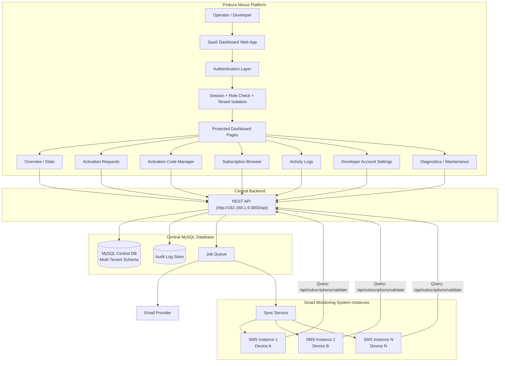

# Developer Dashboard Architecture - Pinkora Nexus SaaS Platform

This document defines the architecture for **Pinkora Nexus**, a SaaS multi-tenant platform built on top of the Smart Monitoring System. It provides a centralized Developer Dashboard for managing activation requests, subscription records, activation codes, and subscriber management across multiple tenant organizations.

**Pinkora Nexus** is a dedicated web-based platform (separate from the Flutter app) that serves as the operational control center and licensing hub. It connects to a centralized MySQL database and exposes a REST API at `http://192.168.1.9:3000/api`, which the Smart Monitoring System instances query to validate subscriptions and manage device activations.

## 1. Purpose

The Developer Dashboard is the internal control panel for platform operators. It is used to:

- Review and fulfill activation requests
- Generate, assign, revoke, and track activation codes
- Inspect subscription records and usage metrics
- View audit logs and system activity
- Manage developer account settings
- Run diagnostics and maintenance tools

## 2. Current App Mapping

The existing Flutter app already contains the main building blocks for this dashboard:

- Developer authentication: [`lib/screens/shared/developer_auth_screen.dart`](./lib/screens/shared/developer_auth_screen.dart)
- Developer account storage: [`lib/services/developer_service.dart`](./lib/services/developer_service.dart)
- Dashboard home: [`lib/screens/developer/developer_dashboard.dart`](./lib/screens/developer/developer_dashboard.dart)
- Subscription stats: [`lib/services/cloud_subscription_service.dart`](./lib/services/cloud_subscription_service.dart)
- Backend API overview: [`backend/README.md`](./backend/README.md)

The web version should keep the same business concepts, but move security and state management to the server.

## 3. High-Level SaaS Multi-Tenant Architecture



## 4. SaaS Multi-Tenant Architecture

### 4.1 Tenant Isolation Strategy

**Pinkora Nexus** uses a **database-level multi-tenant** approach:

- Each tenant organization has its own logical namespace in the shared MySQL database
- Tenant data is separated via a `tenant_id` foreign key on all relevant tables
- All database queries include `WHERE tenant_id = :current_tenant_id` automatically
- Row-level security enforced at the ORM and API layer
- Separate developer/operator accounts per tenant with role-based permissions

### 4.2 Tenant Entity Types

1. **Operator Tenant**: Internal admin team (Pinkora staff)
   - Full access to all platform features
   - Visibility into all subscriptions and device metrics
   - Can manage other developers and reset systems

2. **Business Tenant**: External customer organizations
   - Can view only their own activation codes and subscriptions
   - Can manage their own devices and activation requests
   - Limited access to diagnostics and maintenance tools
   - View their own audit logs only

### 4.3 Shared Services (Tenant-Aware)

- Email notifications (sends to tenant-specific email addresses)
- Audit logging (includes `tenant_id` in all log entries)
- Job queue (segregates background tasks by tenant)
- Subscription sync service (processes each tenant independently)

---

## 5. Layered Architecture

### Presentation Layer

The browser UI should be split into clear pages or tabs:

- Login
- Overview dashboard
- Activation requests
- Activation code manager
- Subscription records
- Activity logs
- Developer account settings
- Diagnostics and maintenance

### Application Layer

This layer handles business logic and orchestration:

- Authentication and session management
- Role-based access control
- Activation request workflow
- Activation code lifecycle
- Subscription lookup and filtering
- Audit logging
- Maintenance and reset operations

### Data Layer

Recommended core entities:

- `developers`
- `activation_requests`
- `activation_codes`
- `subscriptions`
- `audit_logs`
- `system_events`

### Infrastructure Layer

Supporting services:

- REST API
- Database
- Email provider
- Background jobs or queue
- Optional cache layer

## 6. Core Modules

### 5.1 Authentication and Access Control

Responsibilities:

- Developer login
- Session creation and validation
- Role checks
- Logout
- Optional re-authentication for destructive actions
- Optional two-factor authentication

Recommended behavior:

- Use server-side authentication for the web version
- Store passwords as hashes
- Do not rely on client-side local storage for privileged access

### 5.2 Overview Dashboard

Purpose:

- Give a quick operational snapshot

Typical widgets:

- Total subscriptions
- Active subscriptions
- Expired subscriptions
- Unique device count
- Active unique devices
- Package distribution
- Recent activation requests
- Recent activity

### 5.3 Activation Requests

Purpose:

- Review customer requests for activation codes
- Assign a code
- Mark a request as fulfilled
- Trigger notification emails

Typical flow:

1. Customer submits a request
2. Request appears in the developer queue
3. Developer selects an available activation code
4. System assigns the code
5. Email or notification is sent
6. Request is marked fulfilled

### 5.4 Activation Code Manager

Purpose:

- Generate codes
- Export codes to CSV
- Search codes by status or package
- Assign codes to requests
- Revoke or invalidate codes

Code status examples:

- Available
- Assigned
- Used
- Revoked
- Expired

### 5.5 Subscription Records

Purpose:

- Browse all active and expired subscriptions
- Search by device, package, or activation code
- Inspect expiry dates and usage history
- Support CSV export

### 5.6 Activity Logs

Purpose:

- Provide an audit trail of sensitive actions

Log examples:

- Login attempts
- Code generation
- Code assignment
- Code revocation
- Subscription changes
- Factory reset
- Configuration updates

### 5.7 Developer Account Settings

Purpose:

- Update developer profile information
- Change password
- Manage display name and email
- Configure security preferences

### 5.8 Diagnostics and Maintenance

Purpose:

- Test database connectivity
- Verify email delivery configuration
- Check service health
- Inspect subscription sync status
- Confirm integration setup

### 5.9 Factory Reset / Maintenance Tools

Purpose:

- Provide destructive recovery tools for test environments

Important rule:

- Keep factory reset behind strong confirmation and privileged access
- Prefer soft-reset and archive options before hard deletion

## 7. Suggested Website Pages

Recommended routes:

- `/developer/login`
- `/developer/dashboard`
- `/developer/overview`
- `/developer/requests`
- `/developer/codes`
- `/developer/subscriptions`
- `/developer/logs`
- `/developer/settings`
- `/developer/tools`
- `/developer/audit`

## 8. Suggested API Surface

Recommended endpoints:

- `POST /api/developer/login`
- `POST /api/developer/logout`
- `GET /api/developer/me`
- `GET /api/developer/stats`
- `GET /api/developer/activation-requests`
- `POST /api/developer/activation-requests/:id/assign`
- `POST /api/developer/activation-requests/:id/fulfill`
- `GET /api/developer/activation-codes`
- `POST /api/developer/activation-codes`
- `POST /api/developer/activation-codes/:id/revoke`
- `GET /api/developer/subscriptions`
- `GET /api/developer/logs`
- `POST /api/developer/factory-reset`
- `POST /api/developer/diagnostics/test-db`

## 9. Central MySQL Database Schema

### Multi-Tenant Tables

All tables include `tenant_id` for tenant isolation and `created_at`, `updated_at` for audit trail.

#### 9.1 Tenant Management

**tenants**
```sql
CREATE TABLE tenants (
  id INT PRIMARY KEY AUTO_INCREMENT,
  organization_name VARCHAR(255) NOT NULL,
  subdomain VARCHAR(100) UNIQUE,
  api_key VARCHAR(255) UNIQUE,
  subscription_tier ENUM('free', 'basic', 'professional', 'enterprise'),
  max_devices INT DEFAULT 10,
  status ENUM('active', 'suspended', 'archived') DEFAULT 'active',
  contact_email VARCHAR(255),
  created_at TIMESTAMP DEFAULT CURRENT_TIMESTAMP,
  updated_at TIMESTAMP DEFAULT CURRENT_TIMESTAMP ON UPDATE CURRENT_TIMESTAMP,
  deleted_at TIMESTAMP NULL
);
```

#### 9.2 Developer Accounts (Tenant-Specific)

**developers**
```sql
CREATE TABLE developers (
  id INT PRIMARY KEY AUTO_INCREMENT,
  tenant_id INT NOT NULL,
  name VARCHAR(255) NOT NULL,
  email VARCHAR(255) NOT NULL,
  password_hash VARCHAR(255) NOT NULL,
  role ENUM('admin', 'manager', 'operator', 'viewer') DEFAULT 'operator',
  is_active BOOLEAN DEFAULT TRUE,
  last_login_at TIMESTAMP NULL,
  created_at TIMESTAMP DEFAULT CURRENT_TIMESTAMP,
  updated_at TIMESTAMP DEFAULT CURRENT_TIMESTAMP ON UPDATE CURRENT_TIMESTAMP,
  FOREIGN KEY (tenant_id) REFERENCES tenants(id) ON DELETE CASCADE,
  UNIQUE KEY unique_email_per_tenant (tenant_id, email),
  INDEX idx_tenant_id (tenant_id)
);
```

#### 9.3 Activation Codes

**activation_codes**
```sql
CREATE TABLE activation_codes (
  id INT PRIMARY KEY AUTO_INCREMENT,
  tenant_id INT NOT NULL,
  code VARCHAR(50) UNIQUE NOT NULL,
  package_name VARCHAR(100) NOT NULL,
  package_price DECIMAL(10, 2),
  status ENUM('available', 'assigned', 'used', 'revoked', 'expired') DEFAULT 'available',
  device_id VARCHAR(255) NULL,
  device_name VARCHAR(255) NULL,
  assigned_at TIMESTAMP NULL,
  used_at TIMESTAMP NULL,
  revoked_at TIMESTAMP NULL,
  expiration_date DATE NOT NULL,
  created_at TIMESTAMP DEFAULT CURRENT_TIMESTAMP,
  updated_at TIMESTAMP DEFAULT CURRENT_TIMESTAMP ON UPDATE CURRENT_TIMESTAMP,
  FOREIGN KEY (tenant_id) REFERENCES tenants(id) ON DELETE CASCADE,
  INDEX idx_tenant_status (tenant_id, status),
  INDEX idx_device_id (device_id),
  INDEX idx_expiration (expiration_date)
);
```

#### 9.4 Activation Requests

**activation_requests**
```sql
CREATE TABLE activation_requests (
  id INT PRIMARY KEY AUTO_INCREMENT,
  tenant_id INT NOT NULL,
  customer_name VARCHAR(255) NOT NULL,
  customer_email VARCHAR(255) NOT NULL,
  customer_phone VARCHAR(20),
  package_name VARCHAR(100) NOT NULL,
  package_price DECIMAL(10, 2),
  status ENUM('pending', 'assigned', 'fulfilled', 'cancelled') DEFAULT 'pending',
  activation_code_id INT NULL,
  notes TEXT,
  priority ENUM('low', 'medium', 'high') DEFAULT 'medium',
  created_at TIMESTAMP DEFAULT CURRENT_TIMESTAMP,
  updated_at TIMESTAMP DEFAULT CURRENT_TIMESTAMP ON UPDATE CURRENT_TIMESTAMP,
  fulfilled_at TIMESTAMP NULL,
  FOREIGN KEY (tenant_id) REFERENCES tenants(id) ON DELETE CASCADE,
  FOREIGN KEY (activation_code_id) REFERENCES activation_codes(id) ON DELETE SET NULL,
  INDEX idx_tenant_status (tenant_id, status),
  INDEX idx_created_at (created_at)
);
```

#### 9.5 Subscriptions (Linked to Smart Monitoring System)

**subscriptions**
```sql
CREATE TABLE subscriptions (
  id INT PRIMARY KEY AUTO_INCREMENT,
  tenant_id INT NOT NULL,
  device_id VARCHAR(255) NOT NULL,
  device_name VARCHAR(255),
  activation_code_id INT NOT NULL,
  activation_code VARCHAR(50),
  package_name VARCHAR(100) NOT NULL,
  package_price DECIMAL(10, 2),
  status ENUM('active', 'inactive', 'expired', 'cancelled') DEFAULT 'active',
  activated_at TIMESTAMP NULL,
  expires_at TIMESTAMP NOT NULL,
  last_sync_at TIMESTAMP NULL,
  last_heartbeat TIMESTAMP NULL,
  app_version VARCHAR(20),
  platform ENUM('android', 'ios', 'windows', 'linux', 'web'),
  created_at TIMESTAMP DEFAULT CURRENT_TIMESTAMP,
  updated_at TIMESTAMP DEFAULT CURRENT_TIMESTAMP ON UPDATE CURRENT_TIMESTAMP,
  FOREIGN KEY (tenant_id) REFERENCES tenants(id) ON DELETE CASCADE,
  FOREIGN KEY (activation_code_id) REFERENCES activation_codes(id) ON DELETE RESTRICT,
  UNIQUE KEY unique_device_subscription (tenant_id, device_id),
  INDEX idx_status_expires (status, expires_at),
  INDEX idx_last_heartbeat (last_heartbeat)
);
```

#### 9.6 Device Registry

**devices**
```sql
CREATE TABLE devices (
  id INT PRIMARY KEY AUTO_INCREMENT,
  tenant_id INT NOT NULL,
  device_id VARCHAR(255) NOT NULL,
  device_name VARCHAR(255),
  device_model VARCHAR(100),
  os_type ENUM('android', 'ios', 'windows', 'linux', 'web'),
  os_version VARCHAR(20),
  app_version VARCHAR(20),
  device_owner VARCHAR(255),
  location VARCHAR(255),
  registration_date TIMESTAMP DEFAULT CURRENT_TIMESTAMP,
  last_active TIMESTAMP NULL,
  is_active BOOLEAN DEFAULT TRUE,
  created_at TIMESTAMP DEFAULT CURRENT_TIMESTAMP,
  updated_at TIMESTAMP DEFAULT CURRENT_TIMESTAMP ON UPDATE CURRENT_TIMESTAMP,
  FOREIGN KEY (tenant_id) REFERENCES tenants(id) ON DELETE CASCADE,
  UNIQUE KEY unique_device_per_tenant (tenant_id, device_id),
  INDEX idx_last_active (last_active),
  INDEX idx_is_active (is_active)
);
```

#### 9.7 Audit Logs

**audit_logs**
```sql
CREATE TABLE audit_logs (
  id BIGINT PRIMARY KEY AUTO_INCREMENT,
  tenant_id INT NOT NULL,
  actor_id INT,
  actor_name VARCHAR(255),
  action VARCHAR(100) NOT NULL,
  target_type VARCHAR(50),
  target_id INT,
  old_values JSON,
  new_values JSON,
  ip_address VARCHAR(45),
  user_agent VARCHAR(500),
  status ENUM('success', 'failure') DEFAULT 'success',
  error_message TEXT,
  created_at TIMESTAMP DEFAULT CURRENT_TIMESTAMP,
  FOREIGN KEY (tenant_id) REFERENCES tenants(id) ON DELETE CASCADE,
  INDEX idx_tenant_created (tenant_id, created_at),
  INDEX idx_action (action),
  INDEX idx_actor_id (actor_id)
);
```

#### 9.8 System Events & Notifications

**system_events**
```sql
CREATE TABLE system_events (
  id BIGINT PRIMARY KEY AUTO_INCREMENT,
  tenant_id INT NOT NULL,
  event_type VARCHAR(100) NOT NULL,
  severity ENUM('info', 'warning', 'error', 'critical') DEFAULT 'info',
  title VARCHAR(255),
  description TEXT,
  related_entity_type VARCHAR(50),
  related_entity_id INT,
  processed BOOLEAN DEFAULT FALSE,
  created_at TIMESTAMP DEFAULT CURRENT_TIMESTAMP,
  processed_at TIMESTAMP NULL,
  FOREIGN KEY (tenant_id) REFERENCES tenants(id) ON DELETE CASCADE,
  INDEX idx_tenant_processed (tenant_id, processed),
  INDEX idx_severity (severity)
);
```

#### 9.9 Subscription Sync History

**subscription_sync_history**
```sql
CREATE TABLE subscription_sync_history (
  id BIGINT PRIMARY KEY AUTO_INCREMENT,
  tenant_id INT NOT NULL,
  device_id VARCHAR(255),
  subscription_id INT,
  sync_type ENUM('heartbeat', 'validation', 'renewal', 'full_sync'),
  status ENUM('success', 'failed', 'partial') DEFAULT 'success',
  status_code INT,
  response_time_ms INT,
  error_message TEXT,
  sync_data JSON,
  created_at TIMESTAMP DEFAULT CURRENT_TIMESTAMP,
  FOREIGN KEY (tenant_id) REFERENCES tenants(id) ON DELETE CASCADE,
  FOREIGN KEY (subscription_id) REFERENCES subscriptions(id) ON DELETE SET NULL,
  INDEX idx_tenant_device (tenant_id, device_id),
  INDEX idx_created_at (created_at)
);
```

#### 9.10 Email Templates & Notifications

**email_templates**
```sql
CREATE TABLE email_templates (
  id INT PRIMARY KEY AUTO_INCREMENT,
  tenant_id INT NOT NULL,
  name VARCHAR(100),
  template_key VARCHAR(100) UNIQUE,
  subject VARCHAR(255),
  body_html LONGTEXT,
  body_text LONGTEXT,
  variables JSON,
  created_at TIMESTAMP DEFAULT CURRENT_TIMESTAMP,
  updated_at TIMESTAMP DEFAULT CURRENT_TIMESTAMP ON UPDATE CURRENT_TIMESTAMP,
  FOREIGN KEY (tenant_id) REFERENCES tenants(id) ON DELETE CASCADE
);

CREATE TABLE email_queue (
  id BIGINT PRIMARY KEY AUTO_INCREMENT,
  tenant_id INT NOT NULL,
  recipient_email VARCHAR(255),
  template_id INT,
  variables JSON,
  status ENUM('pending', 'sent', 'failed') DEFAULT 'pending',
  retry_count INT DEFAULT 0,
  max_retries INT DEFAULT 3,
  sent_at TIMESTAMP NULL,
  error_message TEXT,
  created_at TIMESTAMP DEFAULT CURRENT_TIMESTAMP,
  FOREIGN KEY (tenant_id) REFERENCES tenants(id) ON DELETE CASCADE,
  FOREIGN KEY (template_id) REFERENCES email_templates(id) ON DELETE SET NULL,
  INDEX idx_status (status),
  INDEX idx_created_at (created_at)
);
```

## 10. Central Database Connection & API Integration

### 10.1 Central API (`http://192.168.1.9:3000/api`)

The Pinkora Nexus backend exposes a centralized REST API that serves two consumer groups:

**1. Dashboard Web App (Internal)**
- Developer authentication and dashboard operations
- Tenant-specific data queries
- Admin management functions
- Audit and diagnostics

**2. Smart Monitoring System Instances (External)**
- Subscription validation queries
- Device activation lookups
- Package information retrieval
- Sync heartbeat and renewal calls

### 10.2 Smart Monitoring System Integration

Each Smart Monitoring System instance running on devices makes periodic API calls to validate licenses and subscriptions:

```
Smart Monitoring System (running on device)
  ↓
  POST http://192.168.1.9:3000/api/subscriptions/validate
  {
    "device_id": "device_uuid",
    "activation_code": "XYZABC-12345",
    "app_version": "2.0.1",
    "platform": "android"
  }
  ↓
Pinkora Nexus Backend (Node.js/Express)
  ↓
  Query MySQL: SELECT * FROM subscriptions WHERE device_id = ? AND activation_code = ?
  ↓
  Response:
  {
    "status": "active",
    "package_name": "Professional",
    "expires_at": "2026-12-31T23:59:59Z",
    "sync_allowed": true,
    "features_enabled": ["inventory", "sales", "cctv", "reports"]
  }
```

### 10.3 Database Connection Pool

The Pinkora Nexus backend maintains a MySQL connection pool:

```javascript
// backend/.env or config
DB_HOST=192.168.1.9
DB_PORT=3306
DB_NAME=pinkora_nexus
DB_USER=app_user
DB_PASSWORD=secure_password
DB_POOL_SIZE=20
DB_POOL_MAX_IDLE_TIME=600000
```

### 10.4 Query Examples

**Validate Device Subscription**
```sql
SELECT 
  s.id,
  s.status,
  s.expires_at,
  s.package_name,
  ac.code,
  t.api_key
FROM subscriptions s
JOIN activation_codes ac ON s.activation_code_id = ac.id
JOIN tenants t ON s.tenant_id = t.id
WHERE s.device_id = ? 
  AND ac.code = ?
  AND s.status IN ('active', 'grace_period')
  AND s.expires_at > NOW()
LIMIT 1;
```

**Get Active Subscriptions by Tenant**
```sql
SELECT 
  s.device_id,
  s.device_name,
  s.package_name,
  s.status,
  s.activated_at,
  s.expires_at,
  d.last_active,
  d.platform
FROM subscriptions s
JOIN devices d ON s.device_id = d.device_id AND s.tenant_id = d.tenant_id
WHERE s.tenant_id = ? 
  AND s.status = 'active'
ORDER BY s.activated_at DESC;
```

**Check Expiring Subscriptions (For Renewal Notifications)**
```sql
SELECT 
  s.id,
  s.device_id,
  s.expires_at,
  t.contact_email
FROM subscriptions s
JOIN tenants t ON s.tenant_id = t.id
WHERE s.status = 'active'
  AND s.expires_at BETWEEN NOW() AND DATE_ADD(NOW(), INTERVAL 7 DAY)
  AND NOT EXISTS (
    SELECT 1 FROM system_events 
    WHERE tenant_id = s.tenant_id 
      AND event_type = 'subscription_expiry_notice'
      AND related_entity_id = s.id
      AND created_at > DATE_SUB(NOW(), INTERVAL 24 HOUR)
  );
```

---

## 11. Security Model

This is the most important difference between the current app and the web version.

Recommended controls:

- Use server-verified login
- Hash passwords with a strong algorithm
- Use role-based permissions
- Protect destructive routes with re-authentication
- Add rate limiting on auth and sensitive endpoints
- Log all privileged actions
- Use secure cookies or signed tokens
- Add CSRF protection if you use cookie sessions

Do not use client-side storage as the source of truth for privileged access.

## 12. Module-to-Code Mapping

The current app maps cleanly to a web dashboard like this:

- Local developer auth in [`lib/screens/shared/developer_auth_screen.dart`](./lib/screens/shared/developer_auth_screen.dart) becomes server-side login
- Local developer account storage in [`lib/services/developer_service.dart`](./lib/services/developer_service.dart) becomes the `developers` table
- Dashboard actions in [`lib/screens/developer/developer_dashboard.dart`](./lib/screens/developer/developer_dashboard.dart) become separate protected pages or widgets
- Subscription stats in [`lib/services/cloud_subscription_service.dart`](./lib/services/cloud_subscription_service.dart) become a stats endpoint
- Activation and license flows in [`backend/README.md`](./backend/README.md) become the API foundation for the website

## 13. Recommended Technology Stack - Pinkora Nexus

Pinkora Nexus Platform Stack:

**Frontend (Dashboard Web App)**
- Framework: Next.js 14+ or React 18+
- UI Components: Tailwind CSS + shadcn/ui
- State Management: Redux Toolkit or Zustand
- HTTP Client: Axios or TanStack Query
- Auth: NextAuth.js or Auth0
- Deployment: Vercel or AWS Amplify

**Backend (Central API)**
- Runtime: Node.js 18+
- Framework: Express.js or Fastify
- ORM: Sequelize, Typeorm, or Prisma
- Validation: Joi, Yup, or Zod
- Auth: JWT + Refresh Token Pattern
- Rate Limiting: Express-rate-limit
- CORS: Secure tenant-aware CORS

**Database**
- DBMS: MySQL 8.0+
- Hosting: Self-managed or AWS RDS
- Connection Pool: mysql2/promise with pooling
- Backup: Automated daily backups with point-in-time recovery
- Monitoring: MySQL Enterprise Monitor or Percona Monitoring and Management

**Infrastructure**
- API Server: EC2 or DigitalOcean
- Database Server: Dedicated MySQL instance (192.168.1.9:3306)
- Load Balancer: Nginx reverse proxy
- Caching: Redis for session store and rate limiting
- Email: SendGrid, Postmark, or AWS SES
- Logging & Monitoring: CloudWatch or ELK Stack
- CDN: Cloudflare or AWS CloudFront

**DevOps & Deployment**
- IaC: Terraform or AWS CloudFormation
- CI/CD: GitHub Actions or Jenkins
- Container: Docker for reproducible environments
- Orchestration: Kubernetes or Docker Swarm (optional)
- Version Control: Git (GitHub, GitLab, or Gitea)

## 14. Implementation Notes

1. Keep the dashboard modular.
2. Separate viewing pages from mutation actions.
3. Use a single source of truth for subscription state.
4. Make activation request fulfillment atomic.
5. Record every destructive operation in audit logs.
6. Avoid hardcoding credentials in the client.
7. Add environment-based configuration for keys and secrets.

## 15. Suggested Build Order for Pinkora Nexus

If you are creating the website next, build it in this order:

1. Authentication and session handling
2. Dashboard overview and stats endpoint
3. Activation request queue
4. Activation code manager
5. Subscription records browser
6. Activity logging
7. Settings and profile management
8. Diagnostics tools
9. Factory reset and admin safety checks

## 16. Smart Monitoring System Integration Points

The Smart Monitoring System (Flutter app) integrates with Pinkora Nexus in the following ways:

### 16.1 Application Startup (On App Launch)

```dart
// In main.dart or app initialization
final cloudService = CloudSubscriptionService();
await cloudService.validateSubscription(
  deviceId: Settings.deviceId,
  activationCode: Settings.activationCode,
);

if (cloudService.isSubscriptionValid) {
  // Load app normally with all features
  runApp(const SmartMonitoringApp());
} else {
  // Show subscription expired or offline message
  showExpiredSubscriptionUI();
}
```

### 16.2 Periodic Sync (Background Task)

```dart
// Background service - runs every 24 hours or on user logout
void syncSubscriptionStatus() async {
  final response = await http.post(
    Uri.parse('http://192.168.1.9:3000/api/subscriptions/validate'),
    headers: {'Content-Type': 'application/json'},
    body: jsonEncode({
      'device_id': Settings.deviceId,
      'activation_code': Settings.activationCode,
      'app_version': appVersion,
      'platform': 'android', // or 'ios', 'windows', etc.
    }),
  );
  
  if (response.statusCode == 200) {
    final subscription = SubscriptionData.fromJson(jsonDecode(response.body));
    await Settings.saveSubscription(subscription);
  }
}
```

### 16.3 API Endpoints Used by Smart Monitoring System

| Endpoint | Method | Purpose | Frequency |
|----------|--------|---------|----------|
| `/api/subscriptions/validate` | POST | Validate device activation | App startup, periodic |
| `/api/subscriptions/:id/renew` | POST | Request subscription renewal | Manual user action |
| `/api/devices/register` | POST | Register new device | First launch |
| `/api/devices/:id/heartbeat` | POST | Send device heartbeat | Every 6 hours |
| `/api/packages` | GET | Fetch available packages | On-demand |
| `/api/feature-flags` | GET | Get tenant-specific features | App startup |

### 16.4 Error Handling & Fallback Behavior

**If API is unreachable:**
- Use cached subscription status (valid for 7 days offline)
- Log sync failure to local database
- Retry on next connection
- Show warning but allow app to function

**If subscription is invalid:**
- Disable premium features
- Show graceful expiration message
- Offer in-app renewal via activation code entry
- Redirect to activation code input screen

### 16.5 Local Storage (Smart Monitoring System)

The Smart Monitoring System stores subscription state locally in SQLite:

```sql
CREATE TABLE subscription_cache (
  id INTEGER PRIMARY KEY,
  device_id TEXT UNIQUE,
  activation_code TEXT,
  status TEXT,
  package_name TEXT,
  expires_at TEXT,
  features_enabled TEXT, -- JSON array
  last_sync_at TEXT,
  cache_expires_at TEXT,
  created_at TEXT
);
```

---

## 17. Short Summary

The Developer Dashboard should be a protected internal admin system with:

- server-side authentication
- activation request workflow
- activation code lifecycle management
- subscription analytics
- audit logging
- maintenance tooling

The current Flutter implementation already contains the business logic conceptually. The web version should reuse the same workflow, but move all privileged logic to the backend.

