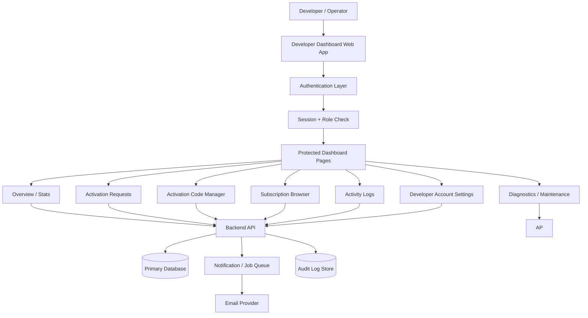

# Developer Dashboard Architecture

This document defines a web-friendly system architecture for the Developer Dashboard used to manage activation requests, subscription records, activation codes, logs, and maintenance tools.

It is based on the current Smart Monitoring System flow, but organized so it can be rebuilt as a separate website with a proper server-side security model.

## 1. Purpose

The Developer Dashboard is the internal control panel for platform operators. It is used to:

- Review and fulfill activation requests
- Generate, assign, revoke, and track activation codes
- Inspect subscription records and usage metrics
- View audit logs and system activity
- Manage developer account settings
- Run diagnostics and maintenance tools

## 2. Current App Mapping

The existing Flutter app already contains the main building blocks for this dashboard:

- Developer authentication: [`lib/screens/shared/developer_auth_screen.dart`](./lib/screens/shared/developer_auth_screen.dart)
- Developer account storage: [`lib/services/developer_service.dart`](./lib/services/developer_service.dart)
- Dashboard home: [`lib/screens/developer/developer_dashboard.dart`](./lib/screens/developer/developer_dashboard.dart)
- Subscription stats: [`lib/services/cloud_subscription_service.dart`](./lib/services/cloud_subscription_service.dart)
- Backend API overview: [`backend/README.md`](./backend/README.md)

The web version should keep the same business concepts, but move security and state management to the server.

## 3. High-Level Architecture

## 4. Layered Architecture

### Presentation Layer

The browser UI should be split into clear pages or tabs:

- Login
- Overview dashboard
- Activation requests
- Activation code manager
- Subscription records
- Activity logs
- Developer account settings
- Diagnostics and maintenance

### Application Layer

This layer handles business logic and orchestration:

- Authentication and session management
- Role-based access control
- Activation request workflow
- Activation code lifecycle
- Subscription lookup and filtering
- Audit logging
- Maintenance and reset operations

### Data Layer

Recommended core entities:

- `developers`
- `activation_requests`
- `activation_codes`
- `subscriptions`
- `audit_logs`
- `system_events`

### Infrastructure Layer

Supporting services:

- REST API
- Database
- Email provider
- Background jobs or queue
- Optional cache layer

## 5. Core Modules

### 5.1 Authentication and Access Control

Responsibilities:

- Developer login
- Session creation and validation
- Role checks
- Logout
- Optional re-authentication for destructive actions
- Optional two-factor authentication

Recommended behavior:

- Use server-side authentication for the web version
- Store passwords as hashes
- Do not rely on client-side local storage for privileged access

### 5.2 Overview Dashboard

Purpose:

- Give a quick operational snapshot

Typical widgets:

- Total subscriptions
- Active subscriptions
- Expired subscriptions
- Unique device count
- Active unique devices
- Package distribution
- Recent activation requests
- Recent activity

### 5.3 Activation Requests

Purpose:

- Review customer requests for activation codes
- Assign a code
- Mark a request as fulfilled
- Trigger notification emails

Typical flow:

1. Customer submits a request
2. Request appears in the developer queue
3. Developer selects an available activation code
4. System assigns the code
5. Email or notification is sent
6. Request is marked fulfilled

### 5.4 Activation Code Manager

Purpose:

- Generate codes
- Export codes to CSV
- Search codes by status or package
- Assign codes to requests
- Revoke or invalidate codes

Code status examples:

- Available
- Assigned
- Used
- Revoked
- Expired

### 5.5 Subscription Records

Purpose:

- Browse all active and expired subscriptions
- Search by device, package, or activation code
- Inspect expiry dates and usage history
- Support CSV export

### 5.6 Activity Logs

Purpose:

- Provide an audit trail of sensitive actions

Log examples:

- Login attempts
- Code generation
- Code assignment
- Code revocation
- Subscription changes
- Factory reset
- Configuration updates

### 5.7 Developer Account Settings

Purpose:

- Update developer profile information
- Change password
- Manage display name and email
- Configure security preferences

### 5.8 Diagnostics and Maintenance

Purpose:

- Test database connectivity
- Verify email delivery configuration
- Check service health
- Inspect subscription sync status
- Confirm integration setup

### 5.9 Factory Reset / Maintenance Tools

Purpose:

- Provide destructive recovery tools for test environments

Important rule:

- Keep factory reset behind strong confirmation and privileged access
- Prefer soft-reset and archive options before hard deletion

## 6. Suggested Website Pages

Recommended routes:

- `/developer/login`
- `/developer/dashboard`
- `/developer/overview`
- `/developer/requests`
- `/developer/codes`
- `/developer/subscriptions`
- `/developer/logs`
- `/developer/settings`
- `/developer/tools`
- `/developer/audit`

## 7. Suggested API Surface

Recommended endpoints:

- `POST /api/developer/login`
- `POST /api/developer/logout`
- `GET /api/developer/me`
- `GET /api/developer/stats`
- `GET /api/developer/activation-requests`
- `POST /api/developer/activation-requests/:id/assign`
- `POST /api/developer/activation-requests/:id/fulfill`
- `GET /api/developer/activation-codes`
- `POST /api/developer/activation-codes`
- `POST /api/developer/activation-codes/:id/revoke`
- `GET /api/developer/subscriptions`
- `GET /api/developer/logs`
- `POST /api/developer/factory-reset`
- `POST /api/developer/diagnostics/test-db`

## 8. Data Model

### developers

- `id`
- `name`
- `email`
- `password_hash`
- `role`
- `created_at`
- `last_login_at`

### activation_requests

- `id`
- `customer_name`
- `customer_email`
- `package_name`
- `package_price`
- `status`
- `activation_code`
- `created_at`
- `updated_at`

### activation_codes

- `id`
- `code`
- `package_name`
- `status`
- `device_id`
- `device_name`
- `used_at`
- `revoked_at`

### subscriptions

- `id`
- `device_id`
- `activation_code`
- `package_name`
- `status`
- `activated_at`
- `expires_at`

### audit_logs

- `id`
- `actor_id`
- `action`
- `target_type`
- `target_id`
- `metadata`
- `created_at`

## 9. Security Model

This is the most important difference between the current app and the web version.

Recommended controls:

- Use server-verified login
- Hash passwords with a strong algorithm
- Use role-based permissions
- Protect destructive routes with re-authentication
- Add rate limiting on auth and sensitive endpoints
- Log all privileged actions
- Use secure cookies or signed tokens
- Add CSRF protection if you use cookie sessions

Do not use client-side storage as the source of truth for privileged access.

## 10. Module-to-Code Mapping

The current app maps cleanly to a web dashboard like this:

- Local developer auth in [`lib/screens/shared/developer_auth_screen.dart`](./lib/screens/shared/developer_auth_screen.dart) becomes server-side login
- Local developer account storage in [`lib/services/developer_service.dart`](./lib/services/developer_service.dart) becomes the `developers` table
- Dashboard actions in [`lib/screens/developer/developer_dashboard.dart`](./lib/screens/developer/developer_dashboard.dart) become separate protected pages or widgets
- Subscription stats in [`lib/services/cloud_subscription_service.dart`](./lib/services/cloud_subscription_service.dart) become a stats endpoint
- Activation and license flows in [`backend/README.md`](./backend/README.md) become the API foundation for the website

## 11. Recommended Technology Stack

Suggested stack for the separate website:

- Frontend: Next.js or React
- UI: Tailwind CSS or a dashboard component system
- Backend: Node.js with Express
- Database: MySQL
- Auth: Secure cookie sessions or JWT
- Email: SMTP or transactional email provider
- Logging: Database audit table plus optional external logging

## 12. Implementation Notes

1. Keep the dashboard modular.
2. Separate viewing pages from mutation actions.
3. Use a single source of truth for subscription state.
4. Make activation request fulfillment atomic.
5. Record every destructive operation in audit logs.
6. Avoid hardcoding credentials in the client.
7. Add environment-based configuration for keys and secrets.

## 13. Suggested Build Order

If you are creating the website next, build it in this order:

1. Authentication and session handling
2. Dashboard overview and stats endpoint
3. Activation request queue
4. Activation code manager
5. Subscription records browser
6. Activity logging
7. Settings and profile management
8. Diagnostics tools
9. Factory reset and admin safety checks

## 14. Short Summary

The Developer Dashboard should be a protected internal admin system with:

- server-side authentication
- activation request workflow
- activation code lifecycle management
- subscription analytics
- audit logging
- maintenance tooling

The current Flutter implementation already contains the business logic conceptually. The web version should reuse the same workflow, but move all privileged logic to the backend.

